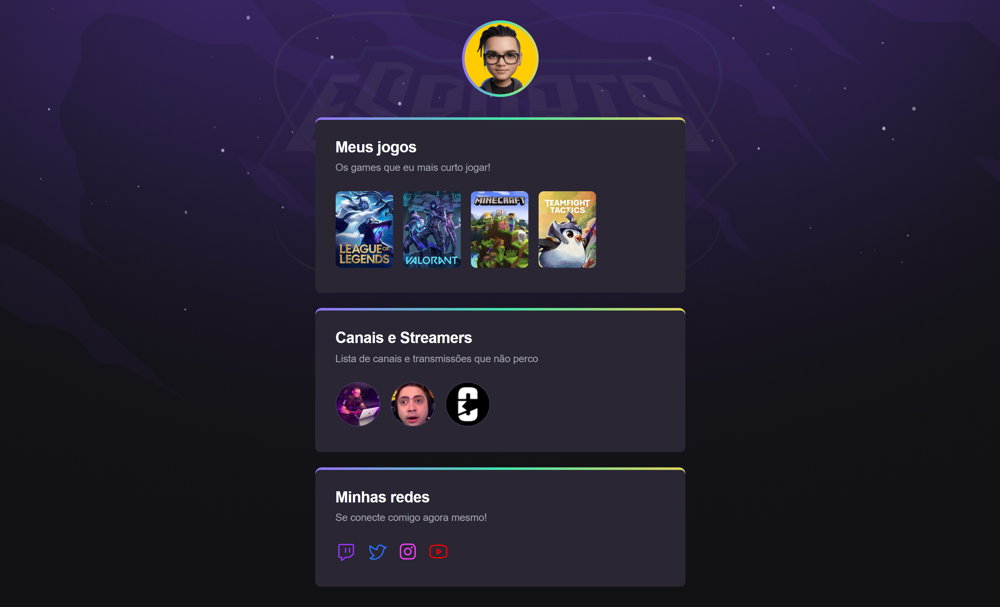
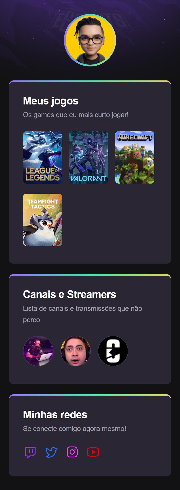

# Nlw eSports Explore

> In this repertoire, a page made in HTML and CSS, already completed, was transformed into a page in ReactJs. Used for ReactJS language training.

## Table of contents

-    [Overview](#overview)
     -    [The challenge](#the-challenge)
     -    [Links](#links)
     -    [Screenshot](#screenshot)
-    [My process](#my-process)
     -    [Built with](#built-with)

## Overview

### The challenge

Users should be able to:

-    See the full website
-    See responsiveness
-    Take advantage of hover features
-    Be forwarded to link destinations

### Links

-    Solution URL: https://maykbrito.github.io/nlw-esports-explorer/
-    Live Site URL: https://nlw-esports-rafael.netlify.app

### Screenshot

-    Desktop

     

-    Mobile

     

## My process

### Built with

-    REACT JS
-    JAVASCRIPT
-    CSS
-    HTML

[⬆ Back to the top](#nlw-esports-explore) 
